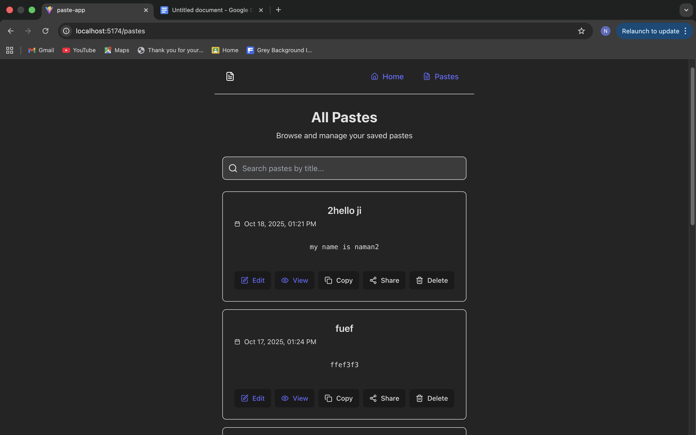
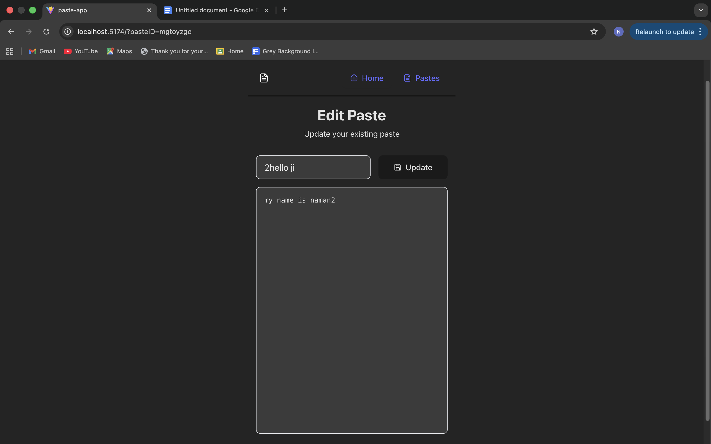

<div align="center">
  
  <h1>🚀 PasteHub 🚀</h1>
  <p><strong>Your personal, in-browser pastebin. Create, edit, and share text snippets with lightning speed. All your data, saved locally. 💾</strong></p>

<p>
    <a href="https://github.com/ChachanNaman/Notes-Saver/stargazers"></a>
    <a href="https://github.com/ChachanNaman/Notes-Saver/network/members"></a>
    <a href="https://github.com/ChachanNaman/Notes-Saver/issues"></a>
  </p>
  <p>
    
    
    
    
  </p>
</div>

---

## ✨ What is PasteHub?

Ever needed to quickly save a code snippet, a brilliant idea, or a long command, but didn't want the hassle of opening a full-blown text editor? **PasteHub is your answer.** It's a slick, modern, and incredibly fast web app that acts as your personal notepad in the cloud... well, in your browser's local storage, which is even faster!

This project is a testament to the power of modern frontend technologies, creating a seamless user experience without needing a backend.

---
## 📸 Live Preview

Here's a sneak peek of PasteHub in action.

| All Pastes Page | Create Paste Page | Edit Paste Page | View Paste Page |
|:---:|:---:|:---:|:---:|
|  |  |  |  |

---

## 📚 Documentation

Want a deep dive into the project's architecture, setup, and features? Check out the full documentation.

➡️ **[View Project Documentation PDF](./Documentation.pdf)**

---

## 🎯 Key Features

* **✍️ Create & Edit Pastes:** A beautiful, distraction-free editor to write and update your notes.
* **💾 Local Storage Persistence:** Your data is safe! All pastes are saved in your browser, so they persist across sessions.
* **🔍 Live Search:** Instantly find the paste you're looking for with a powerful, real-time search filter.
* **📋 One-Click Copy & Share:** Easily copy a paste's content or share a direct view-only link.
* **🎨 Modern UI:** A clean, responsive, and aesthetically pleasing interface built with Tailwind CSS.
* **🚀 Blazing Fast:** Built with Vite for a lightning-fast development and user experience.
* **🔔 Toast Notifications:** Get smooth, non-intrusive feedback for your actions.

---

## 🛠️ Technology Stack

This project is built with a modern, scalable, and efficient tech stack:

* **Core Framework:** [React 18](https://reactjs.org/)
* **State Management:** [Redux Toolkit](https://redux-toolkit.js.org/)
* **Routing:** [React Router DOM](https://reactrouter.com/)
* **Styling:** [Tailwind CSS](https://tailwindcss.com/)
* **Build Tool:** [Vite](https://vitejs.dev/)
* **Icons:** [Lucide React](https://lucide.dev/)
* **Notifications:** [Sonner](https://sonner.emilkowal.ski/)

---

## ⚙️ Getting Started

Ready to run PasteHub on your local machine? Let's get you set up in minutes.

### Prerequisites

* Node.js (v18 or higher recommended)
* npm or yarn

### Installation & Setup

1.  **Clone the Repository:**
    ```bash
    git clone [https://github.com/your-username/pastehub.git](https://github.com/your-username/pastehub.git)
    cd pastehub
    ```

2.  **Install Dependencies:**
    ```bash
    npm install
    ```

3.  **Run the Development Server:**
    ```bash
    npm run dev
    ```

4.  **Open in Browser:**
    Navigate to `http://localhost:5174` (or whatever port your terminal indicates). You should see the application running! 🎉

---

## 🔮 Future Enhancements

PasteHub is awesome, but the journey doesn't stop here. Here are some of the planned features to make it even more powerful:

-   [ ] **Backend Integration:** Connect to a Node.js/Express backend with a database (MongoDB/PostgreSQL) for permanent, cross-device storage.
-   [ ] **User Authentication:** Allow users to sign up and have their own private collection of pastes.
-   [ ] **Dark Mode Toggle:** A UI switch to toggle between light and dark themes.
-   [ ] **Syntax Highlighting:** Automatic code highlighting for different programming languages.

---

## 🤝 Contributing

1.  Fork the Project
2.  Create your Feature Branch (`git checkout -b feature/AmazingFeature`)
3.  Commit your Changes (`git commit -m 'Add some AmazingFeature'`)
4.  Push to the Branch (`git push origin feature/AmazingFeature`)
5.  Open a Pull Request

---

## 📜 License

Distributed under the MIT License. See `LICENSE` for more information.

---

<div align="center">
  <p>Naman Chachan</p>
</div>